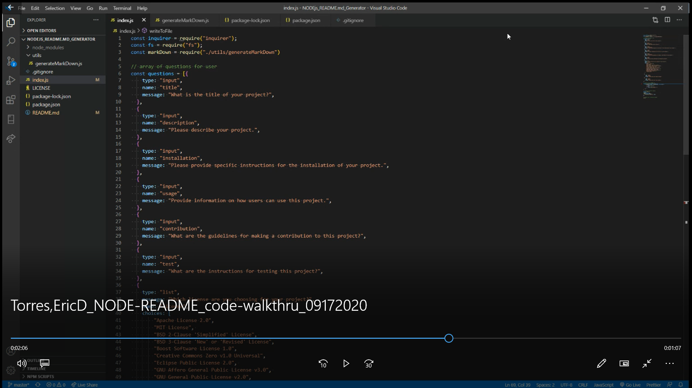
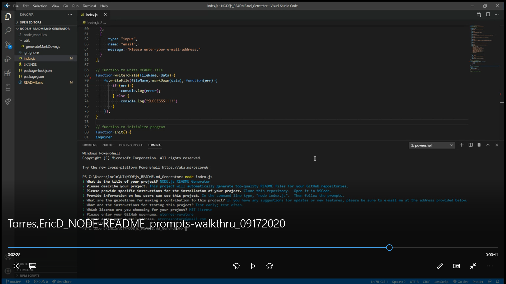
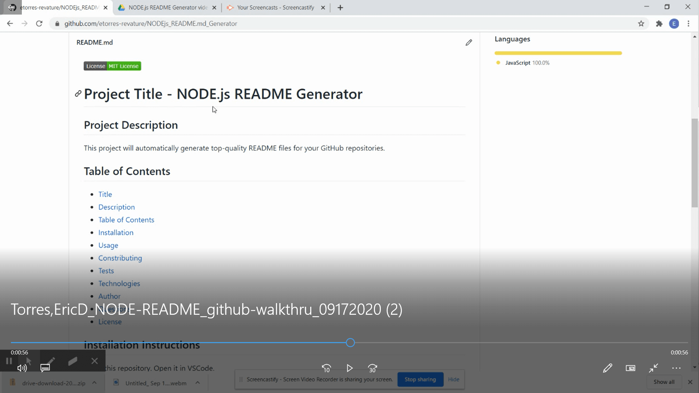
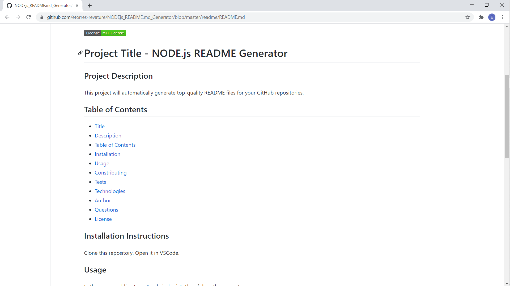

# NODE.js README Generator

## Project Description

This project will automatically generate top-quality README files for your GitHub repositories.

## Table of Contents

* [Title](#project-title)
* [Description](#project-description)
* [Table of Contents](#table-of-congents)
* [Installation](#installation-instructions)
* [Usage](#usage)
* [Contributing](#guidelines-for-contributing)
* [Tests](#tests)
* [Technologies](#technologies-used)
* [Author](#author)
* [Questions](#questions)
* [License](#license)

## Installation Instructions

Clone this repository.  Open it in VSCode.

## Usage 

In the command line type, "node index.js".  Then follow the prompts.

Here are three :movie_camera: **VIDEOS** :movie_camera: that display how to use the application.

1. *CODE* walk through:

2. *PROMPTS* walk through:

3. *GitHub* walk through:

#### [You can also find the README file created in the videos by clicking here or the image below.](./readme/README.md)

## Guidelines for Contributing

If you have any suggestions for updates or new features, please be sure to e-mail me at the address provided below.

## Tests

Test early; test often.

### Technologies Used 
### :computer: :computer: :computer: :computer: :computer: :computer: 

#### :sparkler: JavaScript :sparkler:

**JavaScript (JS)** is one of the core technologies of the World Wide Web (along with HTML and CSS). It enables interactive web pages and is an essential part of web applications.  JS is a multi-faceted, scripting language that provides versatility through Application Programming Interfaces (APIs) and Document Object Model (DOM) manipulation, among others.

*JavaScript* content borrowed from <a target="_blank" rel="noopener noreferrer">[this page](https://en.wikipedia.org/wiki/JavaScript).</a>

#### :globe_with_meridians: NODE.js :globe_with_meridians:

**NODE.js** is an open-source, corss-platform JavaScript runtime environment that execute JavaScript code outside a web browser.  NODE.js lets developers use JavaScript to write command line tools and for server-side scripting.  NODE.js represents a "Javascript everywhere" paradigm, unifying web-application development around a single programming language, rather than different programming languages for server- and client-side scripts.  

*NODE.js* content borrowed from <a target="_blank" rel="noopener noreferrer">[this page](https://en.wikipedia.org/wiki/Node.js).

[Download Node.js](https://nodejs.org/en/).

### Author 

:sunglasses: This *NODE.js README.md Generator* was built by :green_heart: Eric D. Torres :green_heart:

## Questions

Check out my [GitHub profile](https://github.com/etorres-revature).

You can contact me by e-mail at etorresnotary@gmail.com for any additional questions and/ or clarifications you may need about the project.

##### License

This application usese the MIT License.
